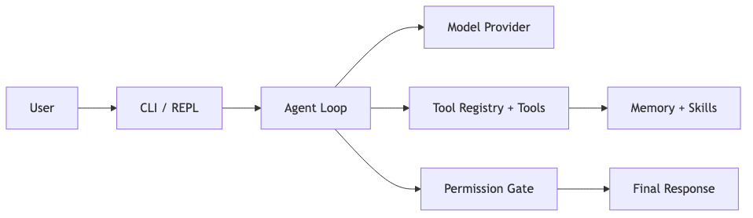
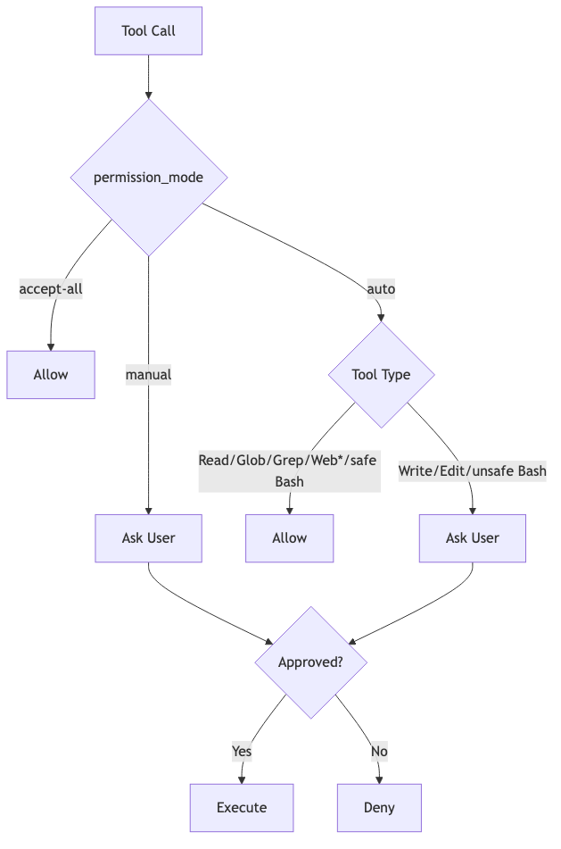
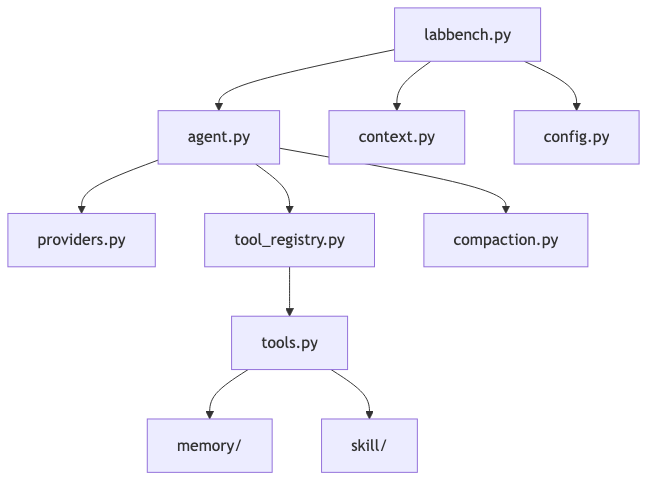

# LabBench

LabBench is an open-source, production-oriented terminal AI assistant for Python, notebooks, and data workflows.
It is intentionally compact, with practical safeguards and operational features for real projects.

## Overview

- Terminal-first workflow with minimal moving parts
- Works in any repository directory (`./.labbench/` for project-local state)
- Supports hosted and local model providers through one interface
- Includes permission controls, tool safety gates, memory, skills, diagnostics, and tests

## Visual Architecture

### 1) End-to-end flow (for technical and non-technical readers)



Interpretation:
- Non-technical: user asks, system runs safely, user gets result.
- Technical: agent orchestrates provider calls, tool execution, memory/skills, and permission checks.

### 2) Permission model (production safety)



### 3) Runtime components (technical map)



### Interactive Excalidraw diagrams

- End-to-end architecture (interactive): [Open diagram](https://excalidraw.com/#json=bqXvrlE3dNHYn45ZRV06q,rILNOg8u_Jx2QmtCnsfyTA)
- Permission decision flow (interactive): [Open diagram](https://excalidraw.com/#json=uS3yu8fc5PCPCYosxSyks,Ff1lRFB1H7bqQNZVt7_JdA)

## Quick Start

```bash
git clone <your-repo-url> labbench
cd labbench
python3 -m venv .venv
source .venv/bin/activate  # Windows: .venv\Scripts\activate
python3 -m pip install -r requirements.txt
python3 labbench.py
```

Set one of these API keys before first run (depending on provider):
- `ANTHROPIC_API_KEY`
- `OPENAI_API_KEY`
- provider-specific keys for other backends in `providers.py`

## Supported Providers

LabBench supports both hosted and local providers through a unified interface.

### Hosted providers
- `anthropic` (Claude)
- `openai` (GPT/o-series)
- `gemini` (Google Gemini via OpenAI-compatible endpoint)
- `kimi` (Moonshot)
- `qwen` (DashScope)
- `zhipu` (GLM)
- `deepseek` (DeepSeek)
- `custom` (any OpenAI-compatible API via `custom/<model>`)

### Local/self-hosted providers
- `ollama` (local server, no cloud key required)
- `lmstudio` (local server, no cloud key required)

Use either:
- Auto-detected model names (example: `claude-opus-4-6`, `gpt-4o`)
- Explicit prefix form (example: `ollama/qwen2.5-coder`, `custom/my-model`)

For exact env var mapping and defaults, see `providers.py`.

## Production Usage

### Interactive (default REPL)

```bash
python3 labbench.py
```

### Interactive with explicit provider/model

```bash
python3 labbench.py -m claude-opus-4-6
python3 labbench.py -m gpt-4o
python3 labbench.py -m gemini-2.0-flash
python3 labbench.py -m ollama/qwen2.5-coder
python3 labbench.py -m custom/my-model
```

### One-shot mode (automation, scripts, CI)

```bash
python3 labbench.py -p "Summarize this pull request"
python3 labbench.py -m gpt-4o -p "Draft release notes from git history"
```

### Operational flags

- `--help` show full CLI and REPL command help
- `--version` print version and exit
- `--verbose` include token/thinking output
- `--thinking` enable extended reasoning where supported
- `--accept-all` disable permission prompts (high trust mode; use cautiously)

## Core Capabilities

- File and shell tooling (`Read`, `Write`, `Edit`, `Bash`, `Glob`, `Grep`)
- Notebook editing (`NotebookEdit`)
- Web tools (`WebFetch`, `WebSearch`)
- Diagnostics (`GetDiagnostics`)
- Human-in-the-loop clarification (`AskUserQuestion`)
- Persistent memory (`memory/`)
- Markdown skills (`skill/`)
- Context compaction for long sessions (`compaction.py`)

## Project Layout

- `labbench.py` CLI, REPL, slash commands, terminal UX
- `agent.py` core loop and permission flow
- `providers.py` model provider adapters
- `tools.py` built-in tools and registration
- `tool_registry.py` tool schema/dispatch system
- `memory/` memory persistence and memory tools
- `skill/` skill parsing, built-ins, and skill tools
- `context.py` system prompt assembly
- `config.py` config/session persistence

## Configuration and State

- Global config: `~/.labbench/config.json`
- Global sessions: `~/.labbench/sessions/`
- Project-local state: `./.labbench/` (memory and project skills)

The clone folder name does not matter; runtime paths are based on home and current working directory.

## Safety Model

LabBench can run shell commands and edit files. Safety is enforced via:
- permission modes (`auto`, `manual`, `accept-all`)
- safe-command allowlist for auto-approved `Bash`
- explicit prompts for sensitive operations

Always review before enabling `--accept-all` in sensitive environments.

## Development

Run tests:

```bash
python3 -m pip install -r requirements-dev.txt
python3 -m pytest tests/ -v
```

## Troubleshooting

### `python: command not found`

Use `python3` explicitly:

```bash
python3 labbench.py
```

### `bad interpreter` from `.venv/bin/pip`

Your virtual environment likely points to an old path. Rebuild it:

```bash
deactivate 2>/dev/null || true
rm -rf .venv
python3 -m venv .venv
source .venv/bin/activate
python3 -m pip install --upgrade pip
python3 -m pip install -r requirements.txt
```

### `PermissionError` on history file

Recent versions of LabBench handle restricted history-file permissions gracefully. If you still see this,
pull latest `main` and rerun.

Docs:
- Architecture: [docs/architecture.md](docs/architecture.md)
- Contributor guide: [docs/contributor_guide.md](docs/contributor_guide.md)

## License

Licensed under Apache License 2.0. See [LICENSE](LICENSE) and [NOTICE](NOTICE).
